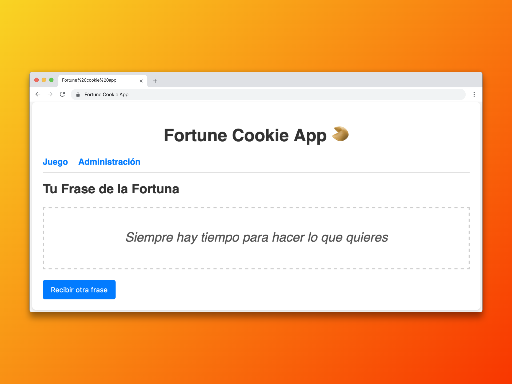
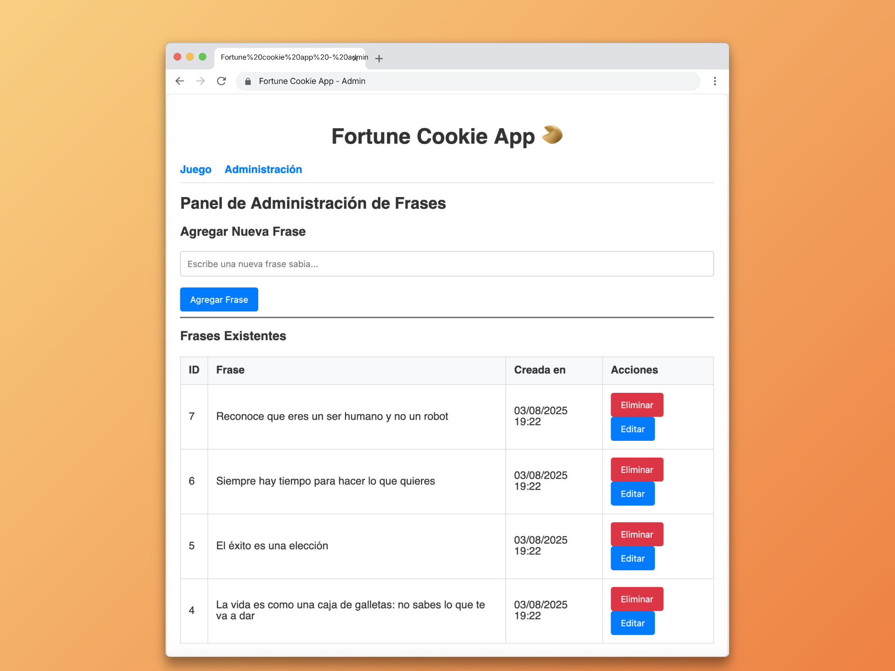

# Fortune Cookie App 🥠



Una aplicación web que simula galletas de la fortuna, mostrando frases inspiradoras y motivacionales de forma aleatoria.

## 🛠️ Tecnologías Utilizadas

- **Backend**: Laravel (PHP)
- **Frontend**: AngularJS
- **Base de Datos**: MySQL/SQLite
- **Servidor Local**: http-server

## 📋 Prerrequisitos

Antes de comenzar, asegúrate de tener instalado:

- PHP >= 8.0
- Composer
- Node.js >= 14.x
- npm
- MySQL

## 🚀 Instalación y Configuración

### 1. Clonar el repositorio

```bash
git clone https://github.com/estebanhirzfeld/Fortune-Cookie-App.git
cd fortune-cookie-app
```

### 2. Configuración del Backend (Laravel)

```bash
cd backend
composer install
npm install

# Generar clave de aplicación
php artisan key:generate

# Ejecutar migraciones
php artisan migrate

# Iniciar servidor de desarrollo
php artisan serve
```

El backend estará disponible en: `http://localhost:8000`

### 3. Configuración del Frontend (AngularJS)

```bash
cd frontend

# Instalar servidor HTTP global (si no lo tienes)
npm install -g http-server

# Iniciar servidor frontend
http-server -p 5500
```

El frontend estará disponible en: `http://localhost:5500`

## ✨ Funcionalidades

### 🎯 Funciones Principales

- **Generación Aleatoria**: Al cargar la aplicación, se muestra una frase de la fortuna seleccionada aleatoriamente
- **Nueva Frase**: Botón "Recibir otra frase" para generar una nueva frase sin recargar la página
- **Interfaz Intuitiva**: Diseño simple y atractivo que simula abrir una galleta de la fortuna

### 🔧 Panel de Administración



Funcionalidades administrativas para gestionar el contenido:

- **➕ Agregar Frases**: Crear nuevas frases motivacionales
- **✏️ Editar Frases**: Modificar frases existentes
- **🗑️ Eliminar Frases**: Remover frases del sistema
- **📊 Gestión Completa**: CRUD completo para el manejo de contenido

## 📁 Estructura del Proyecto

```
fortune-cookie-app/
├── backend/          # API Laravel
│   ├── app/
│   ├── routes/
│   ├── database/
│   └── ...
├── frontend/         # Aplicación AngularJS
│   ├── partials/
│   ├── app.js
│   ├── style.css
│   └── index.html
└── README.md
```

## 🔌 API Endpoints

### Base URL: `http://localhost:8000/api`

#### Test
- `GET /test` - Verificar que la API esté funcionando

#### Cookies (Frases de la Fortuna)
- `GET /cookies` - Obtener todas las frases
- `GET /cookies/random` - Obtener frase aleatoria
- `POST /cookies` - Crear nueva frase
- `PUT /cookies/{cookie}` - Actualizar frase específica por ID
- `DELETE /cookies/{cookie}` - Eliminar frase específica por ID

## 🎨 Características Técnicas

- **SPA (Single Page Application)** con AngularJS
- **Enrutamiento** implementado con AngularJS Router para navegación fluida
- **API RESTful** desarrollada en Laravel
- **Responsive Design** adaptable a diferentes dispositivos
- **CORS configurado** para comunicación entre frontend y backend

## 📝 Uso

1. Accede a `http://localhost:5500`
2. La aplicación mostrará automáticamente una frase de la fortuna
3. Haz clic en "Recibir otra frase" para obtener una nueva
4. Para administrar frases, accede al panel de administración
